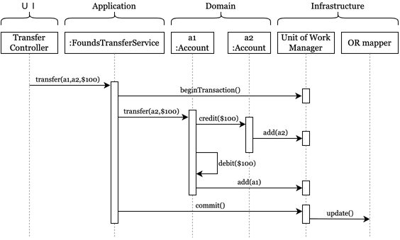

# 從時序圖解析 Domain Model 的互動邊界與職責

在學習 Domain-Driven Design (DDD) 時，釐清「領域模型 (Domain Model)」與系統其他組件間的邊界，是將理論轉化為實作的關鍵。透過一份經典的「資金轉帳 (Funds Transfer)」時序圖，我們可以清楚地洞察系統架構的四個層次：**UI**、**Application**、**Domain** 與 **Infrastructure**，並藉此回答三個在 DDD 中最常被探討的核心觀念。

## 1. Domain（領域）是由哪些物件組成的？

在這張跨帳戶轉帳的時序圖中，Domain 層包含了真正的業務主角：`a1 :Account`（轉出帳戶）與 `a2 :Account`（轉入帳戶）。

在 DDD 中，這類核心物件通常被設計為「**實體 (Entity)**」或「**聚合根 (Aggregate Root)**」。它們絕不僅僅是一堆只有 `getter/setter` 的純資料結構（也就是所謂的貧血模型），而是**充滿行為 (Behavior) 與業務規則的物件**：
- `a1` 知道如何檢查餘額並對自己進行扣款 (`debit($100)`)。
- `a2` 知道如何為自己進行入帳 (`credit($100)`)。
- 在部分設計中（如圖所示），`a1` 甚至包含了與另一個帳戶物件互動的邏輯：當接收到轉帳指令 `transfer(a2, $100)` 時，它能主動去呼叫 `a2` 的 `credit`。

這彰顯了 DDD 的核心理念：**高內聚**。所有的轉帳規則、金額檢查等商業邏輯，都牢牢鎖死在這些 Domain 物件中，無論誰來呼叫它，規則都不會被輕易繞過。

## 2. 外部物件如何與 Domain 互動？

這裡的「外部物件」指的是來自應用層 (Application Layer) 的 `:FoundsTransferService`。在 DDD 架構下，應用服務扮演的是「協調者」或「管弦樂團指揮」的角色。

觀察圖中 Application 如何操作 Domain：
1. **傳遞意圖**：UI 層（`Transfer Controller`）將使用者的操作轉化為程式請求 `transfer(a1, a2, $100)` 交給 Service。
2. **準備環境**：Service 先呼叫基礎設施層的 `Unit of Work Manager`，開啟交易 (`beginTransaction()`)。
3. **下達任務指派，而非干涉細節（重要！）**：接著，Service **並沒有**從 `a1` 拿取金額、自己做減法、再存回 `a1`。相反地，它直接將任務委派給領域物件，向 `a1` 發出命令 `transfer(a2, $100)`。
4. **結束工作**：Domain 完成內部的運算與狀態變更後，Service 再協調基礎設施進行提交 (`commit()`)。

這說明了一件事：**外部物件（Application Service）不負責做業務運算，只負責編排 Use Case 的流程（管理事務與載入/儲存實體）。**

## 3. Domain 如何與外部設施互動？

在傳統開發中，當資料變更時，我們常常直接讓邏輯層呼叫 `Database.update()`。但 DDD 十分強調「基礎設施的隔離（持久化無知）」，Domain 不應該知道 SQL 或 ORM 架構。那狀態改變要怎麼儲存？

從圖示的後半段給出了一個經典模式（結合 Unit of Work）：
1. 當 `a1` 呼叫 `a2.credit($100)` 導致 `a2` 的狀態（餘額）改變時，會向基礎設施層發出一個 `add(a2)` 的通知，將自己註冊到 `Unit of Work Manager`（工作單元）。這代表著：「我的狀態變更了（Dirty），請把我登記起來」。
2. 同理，`a1` 在 `debit($100)` 完成後，也呼叫 `add(a1)` 將自己登記進工作單元。
3. Domain 物件的責任到此為止！它**並沒有**自己依賴 `OR mapper` 去寫入資料庫。它只依賴抽象的概念（告知狀態有變）。
4. 直到最外層的 Application 呼叫 `commit()` 時，`Unit of Work Manager` 才統一將剛剛登記的 `a1` 與 `a2` 的最終狀態變化，透過 `update()` 轉交給 `OR mapper` 寫入儲存系統中。

如此一來，Domain 核心被完美地保護了起來，保持了與底層技術細節的解耦，測試領域邏輯時也不再需要啟動真實的資料庫。

## 結語

透過一張 Funds Transfer 的簡單時序圖，我們能深刻體驗到 DDD 架構中層級分明的責任歸屬：
- **UI 負責溝通介接**
- **Application 負責協調流程**
- **Domain 專注於保護並執行商業邏輯**
- **Infrastructure 負責隱藏技術細節（DB、外部 API）**

將行為從 Service 歸還給 Entity，是我們踏出「貧血模型」，走向真正具備豐富表達力的「領域驅動設計」的第一步。
