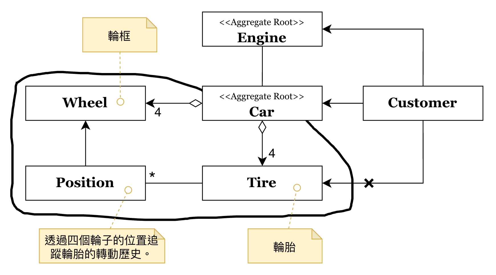
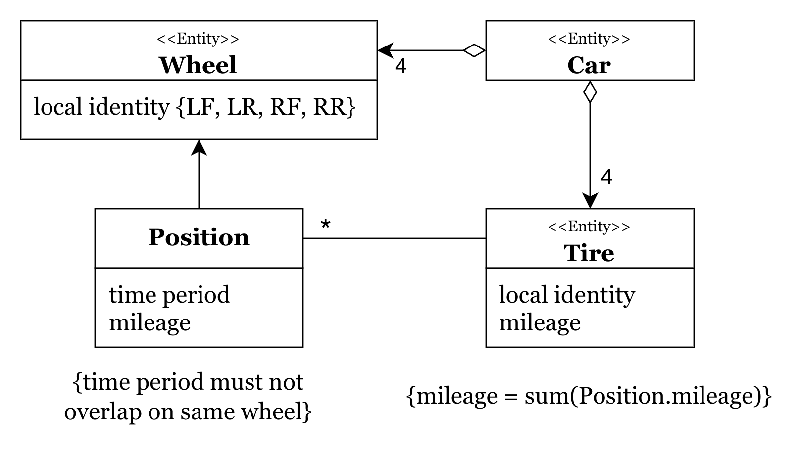

# 聚合 (Aggregates) 與資料變更邊界

在大型系統中的模型關聯往往錯綜複雜。如果我們允許系統中的任何物件都能隨意存取並修改其他物件，就難以確保這些關聯在變動後仍能符合「始終成立的業務規則 (Invariants)」，導致模型陷入不一致、不正確的狀態。

**聚合 (Aggregates)** 的出現，正是為了定義一個清晰的 **聚合邊界 (Aggregate Boundary)**，將一組具有密切關聯的物件群組化，並由一個單一的入口來守護邊界內部的正確性。

---

## 聚合邊界：汽車 (Car) 的外部視角

首先，我們從「外部」如何觀察與操作一個聚合開始看起。

### 1. 聚合根 (Aggregate Root)

在上面的範例中，**Car** 被定義為 **聚合根 (Aggregate Root)**。

- **唯一入口**：外部物件（如 Customer）只能持有對 Car 的引用。所有對汽車零件（如輪胎）的操作，都必須透過 Car 提供的介面。
- **存取控制**：注意到圖中從 Customer 到 Tire 的連線上有一個 **`X` 標記**。這明確表示：外部物件不應越權直接存去 Aggregate Root 內部的細節。

### 2. 資料變更的邊界
當我們說聚合是一個「資料變更邊界」時，意味著在一個交易（Transaction）中，所有被聚合封裝的物件都應視為一個整體進行更新。這能大幅簡化鎖定機制（Locking）並確保資料的一致。

---

## 內部結構：落實始終成立的業務規則

接著，我們深入聚合「內部」，看看規則是如何被落實的。

### 1. 區域識別碼 (Local Identity)
聚合內部的物件（如 Wheel, Tire, Position）在聚合邊界之外通常沒有獨立存在的意義，因此它們通常使用 **區域識別碼 (Local Identity)**。例如，Wheel 在 Car 內部的 ID 是 `LF` (左前) 或 `RR` (右後)，但在離開 Car 之後，單獨一個叫 `LF` 的輪框是沒有意義的。

### 2. 維護 Invariants (始終成立的業務規則)
聚合最重要的職責是維護那些在任何資料變更後都必須「始終成立」的業務規則。從圖中可以看到兩項關鍵規則：

1. **時間不重疊**：`{time period must not overlap on same wheel}` —— 同一個輪框在同一時間只能安裝一個輪胎。
2. **里程數累積一致**：`{mileage = sum(Position.mileage)}` —— 輪胎的總里程必須等於它在各個位置（Position）所行駛里程的加總。

這些規則不應散落在外部程式碼中，而應由 **Car** (聚合根) 在執行如 `replaceTire()` 或 `recordMileage()` 等行為時負責檢查並確保。

---

## 結語

聚合是 DDD 戰術設計中維護複雜業務邏輯的關鍵工具。透過定義明確的 **聚合邊界** 並嚴格限制存取路徑，我們不僅簡化了物件之間的導航，更確保了核心業務規則在複雜的模型跳轉中不會失守。
