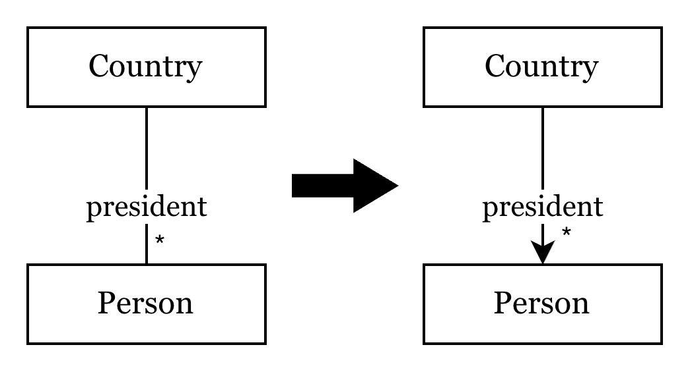
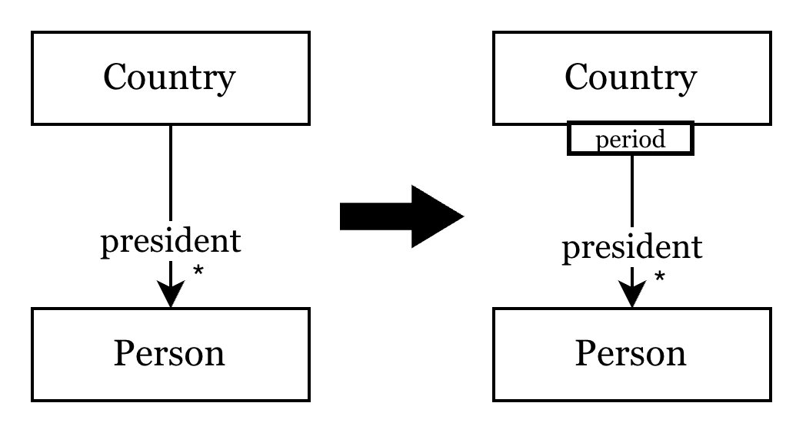
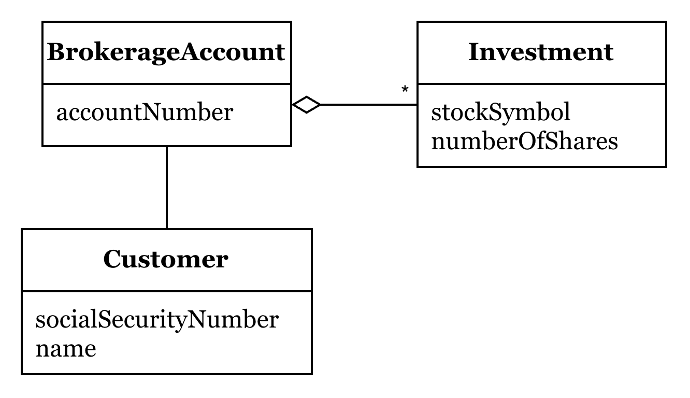
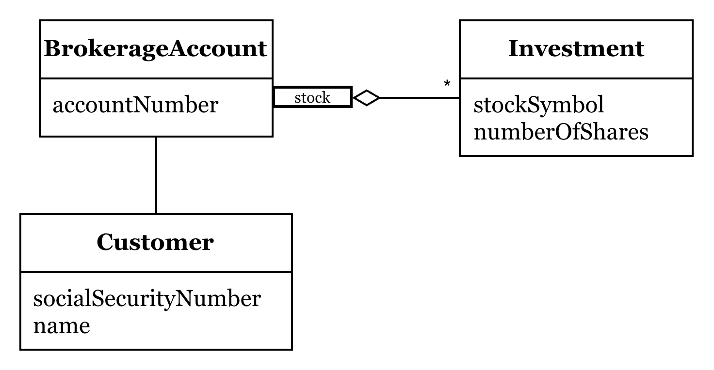

# 關聯 (Associations) 與模型導航

在 Domain-Driven Design (DDD) 中，模型之間的 **關聯 (Associations)** 設計直接影響系統的複雜度與效能。現實世界中的事物往往存在錯綜複雜的雙向、多對多關係，但在軟體模型中，我們應致力於將這些關聯「簡化」與「具體化」。

## 簡化關聯的三個原則

透過以下三個原則，我們能大幅降低模型維護的成本：

1. **強制規定遍歷方向 (Imposing a traversal direction)**
   盡量將雙向關聯簡化為單向。若業務邏輯僅需「從 A 找到 B」，就應移除「從 B 到 A」的引用。這能有效降低物件間的耦合度。

2. **使用限定詞 (Adding a qualifier) 縮減多重性**
   當遇到一對多 (1:N) 的情況時，透過特定屬性（Qualifier）來檢索，將其轉變為更精確的查詢，減少在記憶體中維護大集合（Collection）的負擔。

3. **消除非必要關聯 (Eliminating nonessential associations)**
   對核心業務邏輯無直接貢獻的關聯應果斷移除，保持模型職責清晰。

---

## 實踐範例

### 範例一：國家與總統關係之簡化

這個範例展示了如何逐步將一個複雜關係具象化。

#### 1. 簡化關聯方向與數量關係
原始模型中「國家」與「總統」可能存在複雜的雙向導航。下圖展示了將其簡化為單向一對多關係：我們只需從「國家」找到歷任「總統」，而毋須讓總統持有國家的引用。

{width=50%}

#### 2. 引入限定詞 (Qualifier)
進一步優化地，我們可以使用「年份」作為限定詞。這將 1:N 的關係轉變為更精確的關聯：給定一個國家與年份，即可直接定位到一位總統。

{width=50%}

---

### 範例二：證券帳戶與投資持股 (Brokerage Account)

在金融系統中，「證券帳戶 (BrokerageAccount)」與「投資項 (Investment)」是經典的關聯設計案例。

{width=60%}

- **Customer**: 開戶的客戶。
- **BrokerageAccount**: 存放資金與持股的聚合根。
- **Investment**: 特定股票的持有狀態（含代碼、股數）。

#### 實作方案 A：基於物件直接引用 (Object Reference)
這是最直觀的實作方式，適合資料量較小且需要頻繁操作物件集合的情境：

```java
class BrokerageAccount {
   private String accountName;
   private Customer customer;
   private Set<Investment> investments; // 直接持有物件集合
   
   public Customer getCustomer() {
      return customer;
   }

   public Set<Investment> getInvestments() {
      return investments;
   }
}
```

#### 實作方案 B：基於外部查詢 (Query via Service/Repository)
當考慮到系統效能或資料庫獨立性時，我們也可以不直接持有物件參考，而是透過服務動態查詢：

```java
class BrokerageAccount {
   private String accountNumber;
   private String customerSSN; // 僅儲存 ID

   public Customer getCustomer() {
      // 透過查詢服務讀取，符合持久化無知 (Persistence Ignorance)
      return QueryService.findSingleCustomerFor("""
         SELECT * FROM CUSTOMER WHERE SS_NUMBER = '%s'
         """, customerSSN);
   }

   public Set<Investment> getInvestments() {
      return QueryService.findInvestmentsFor("""
         SELECT * FROM INVESTMENT WHERE BROKERAGE_ACCOUNT_NUMBER = '%s'
         """, accountNumber);
   }
}
```

#### 實作進階：當「限定關聯」套用到實作時

如果業務規則規定 **「每支股票在帳戶中只能對應一筆投資紀錄」**，我們就可以透過 `stockSymbol` 作為限定詞來簡化多重性。

{width=65%}

在實作上，這會讓導航變得極其高效：

##### 方案 1：基於記憶體 Map 的限定導航
```java
class BrokerageAccount {
   private String accountName;
   private Customer customer;
   // 使用股票代碼作為 Key，確保唯一性與快速檢索
   private Map<String, Investment> investments; 
   
   public Customer getCustomer() {
      return customer;
   }

   public Investment getInvestment(String stockSymbol) {
      return investments.get(stockSymbol); // O(1) 檢索
   }
}
```

##### 方案 2：基於資料庫 SQL 的限定查詢
```java
class BrokerageAccount {
   private String accountNumber;
   private String customerSSN;

   public Investment getInvestment(String stockSymbol) {
      // 在 SQL 層級套用限定詞 (WHERE)，只抓取需要的資料
      return QueryService.findSingleInvestmentFor("""
         SELECT * FROM INVESTMENT 
         WHERE BROKERAGE_ACCOUNT_NUMBER = '%s' 
         AND STOCK_SYMBOL = '%s'
         """, accountNumber, stockSymbol);
   }
}
```

> **提示**：以上 SQL 僅供教學示意，未考慮 SQL Injection 之安全性問題。

---

## 結語：為什麼簡化關聯很重要？

在 DDD 的戰術設計中，**關聯必須是「可管理的」**。
透過減少遍歷方向、引入限定詞與消除贅餘關聯，我們不僅降低了系統的認知負荷，更優化了效能。這種對關聯的精挑細選，是建立穩健、高效 **聚合 (Aggregate)** 邊界的基礎。
